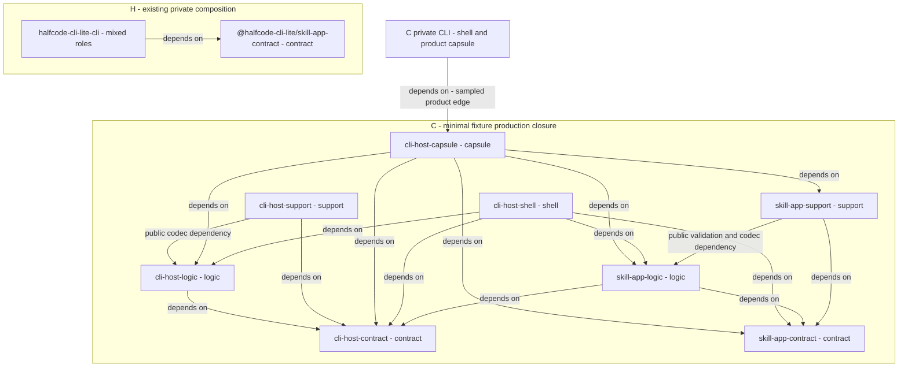

# Existing package boundaries and command-host closure

Names inside the C closure omit only the existing `depa-codument-` prefix; all eight nodes are installed by the minimal fixture because its five CLI Host packages transitively require all three Skill App packages. Browser, Vue and MCP packages are outside this closure, but compiler, AJV, YAML and Hono vendor dependencies remain, so a small root import is not the same as a small installation. The two support-to-logic arrows use public codecs or validation APIs and are not demonstrated private-import violations; the inventory established no package cycle. Halfcode's mixed private CLI and its scoped contract are actual present boundaries, not suggested package destinations.

Evidence: [package rows C03–C10, H02–H03 and dependency-policy conclusion](../../inventory/package-boundaries.md), [PD07 and PD08](../../inventory/provenance-distribution.md). Source anchors: `C/packages/cli-host-capsule/package.json:25`, `C/packages/cli-host-shell/package.json:15`, `C/packages/cli-host-support/src/codex.ts:3`, `C/packages/skill-app-support/src/sop/notebook-store.ts:3`, `H/packages/cli/src/cli/runtime.ts:3`. Product edges are sampled; the [complete inventory](../../inventory/package-boundaries.md) owns all dependency lists.
