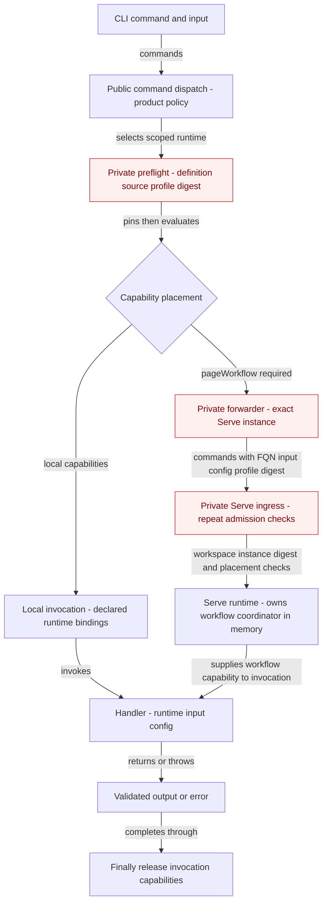

# LocalFunction: one-shot CLI versus live Serve

The public placement rule routes workflow-dependent functions to an existing exact Serve instance, while local capabilities execute through an invocation-scoped runtime; forwarding does not automatically start a server. Serve repeats workspace, agent, instance, source digest and placement checks before allowing its live workflow capability into the handler, so a rendezvous record is not sufficient authority. Red marks R02's reuse gap: the complete preflight, forwarding and HTTP re-admission composition still lives in the private Codument product, even though dispatch and placement primitives are public. Both invocation paths converge on validated handler execution and capability release, and product shutdown separately drains functions/workflows before releasing browser and resource-host ownership.

Evidence: [P05.1–P05.7](../../inventory/read-write-paths.md), [F02/F13/F14](../../inventory/fact-nodes.md), [local versus Serve extension seam](../../boundary/fact-roles.md), [R02](../../boundary/backwrite-risks.md). Red-node anchors: `A/packages/cli/src/cli/runtime/local-function-execution.ts:30`, `:66`, `A/packages/cli/src/cli/http/app.ts:207`; shared placement and release: `A/packages/skill-app-logic/src/local-function.ts:34`, `:71`, `:81`; teardown: `A/packages/cli/src/cli/runtime.ts:167`. Bare-CLI `pageTargets` rejection and unsupported capability errors are guards in the placement rule, omitted as terminal branches for readability.
