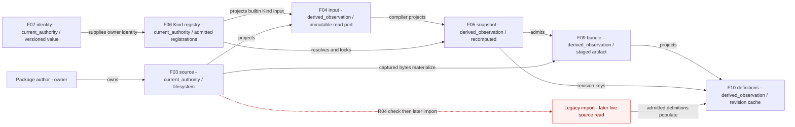

# Authored truth, admission and derived execution views

The package author owns physical source, and Kind registrations declare semantic ownership; the virtual builtin input, resolved snapshot, staged bundles and definition cache are projections with distinct lifetimes. Package-profile TypeScript descriptors are another declared source entry and are cross-checked against discovered resources; that branch is documented in F08/P02 and omitted here to keep the projection view focused. The red R04 branch is a conditional checked-bytes versus imported-bytes race in legacy loading, because `beforeLoad` can separate digest validation from importing the live source path; it is not a source backwrite and was not reproduced in this design scan. No projection-to-source arrow or competing runtime authority was established, while R01 separately warns that changing the contract package name affects identity, fingerprints and locks.

Evidence: [F03–F10](../../inventory/fact-nodes.md), [P01–P04](../../inventory/read-write-paths.md), [resource owners](../../boundary/single-writer.md), [R01, R04 and R05](../../boundary/backwrite-risks.md). Red-edge anchors: `A/packages/skill-app-support/src/resources/bundle-materializer.ts:174`, `:177`, `:189`, `:192`; positive projection anchors: `A/packages/skill-app-support/src/resources/authored-loader.ts:14`, `:33`, and `A/packages/skill-app-support/src/resources/workspace-resource-catalog.ts:753`. R05 leaves dependency-byte immutability uncertain even on the staged package branch; the diagram does not imply it is fully pinned.
