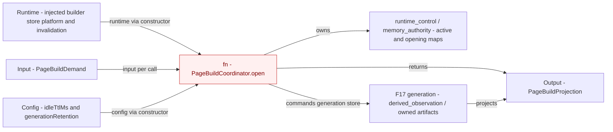

# PageBuild: current input, output, runtime and configuration

The current API is an object constructor plus `open(demand)`, not a standalone exported `fn(runtime,input,config)`; the three arrows expose where those axes enter today. The red component retains injected effect ports, configuration, mutable ownership state and processing methods in one instance, which the DEPA inventory marks as partial runtime/effect separation at `page-build.ts:20`, `:34` and `:69`. This colocation finding does not imply competing state owners: the coordinator owns admitted work while the generation store owns rebuildable artifacts and their current projection. A separate positive IORC seam exists in LocalFunction execution, where the handler receives capabilities, input and config and releases per-invocation runtime in `finally`.

Evidence: [Effect dimension and runtime-explicitness check](../../inventory/depa-conformance.md), [F13/F17](../../inventory/fact-nodes.md), [generation owner](../../boundary/single-writer.md). Source anchors: `A/packages/cli-host-capsule/src/page-build.ts:20`, `:34`, `:69`; `A/packages/skill-app-support/src/page-generation-store.ts:140`, `:160`; `A/packages/skill-app-logic/src/local-function.ts:71`, `:81`. The graph records a present ownership seam and does not prescribe a new package split.
