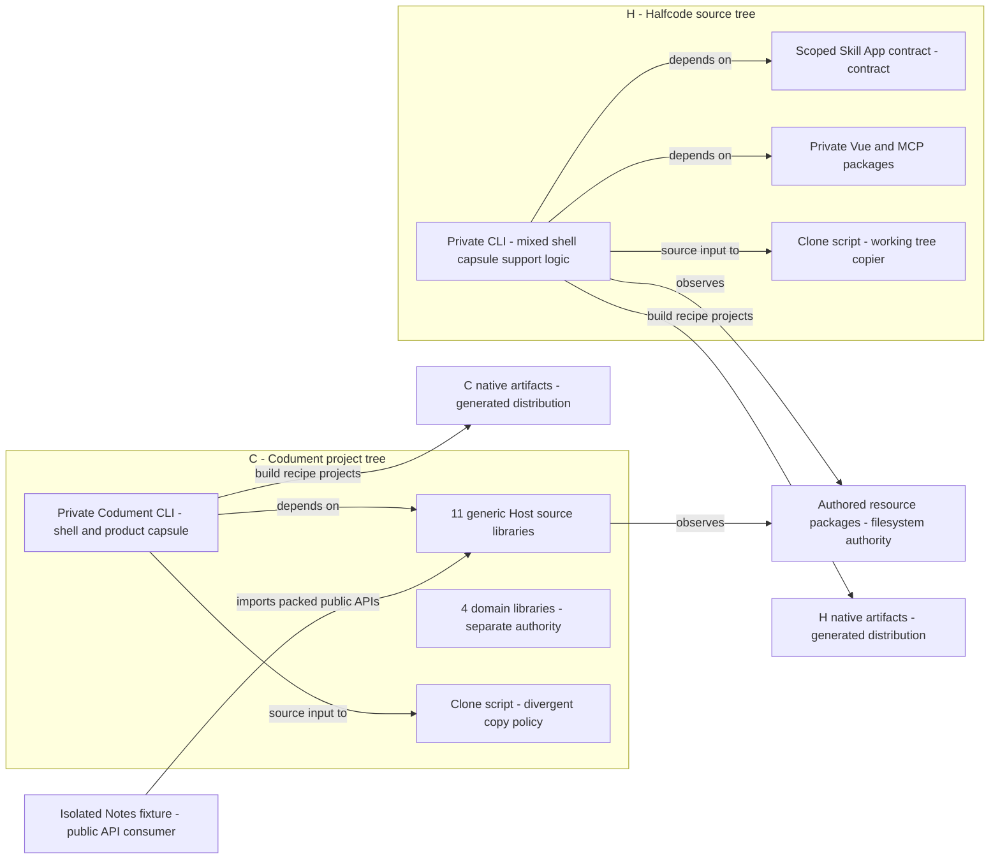

# Two repositories: current source and composition

Halfcode currently keeps most Host mechanisms inside its private CLI, while Codument has extracted eleven generic source libraries and four separate domain libraries; the domain node has no product-admission arrow because default Codument Kind registration is still absent (R03). The Notes fixture is an existing packed public-API consumer, but local tarball overrides and inspected assertions are not evidence of npm publication or current Halfcode adoption. Each native artifact arrow denotes a release recipe, not a successful release: PD03 and PD04 record concrete Codument release-check mismatches. The two clone scripts copy working-tree material and now differ in root filtering and replacement order; this view therefore draws no current cross-repository synchronization arrow.

Evidence: [package rows C02–C20 and H02–H08](../../inventory/package-boundaries.md), [provenance PD01–PD06 and consumer fixture](../../inventory/provenance-distribution.md), [domain ingress F18](../../inventory/fact-nodes.md), and [R03](../../boundary/backwrite-risks.md). Source anchors: `C/packages/cli/package.json:15`, `H/packages/cli/src/cli/runtime.ts:36`, `C/scripts/verification/consumer.ts:50`, `C/packages/cli/src/cli/runtime.ts:86`.
